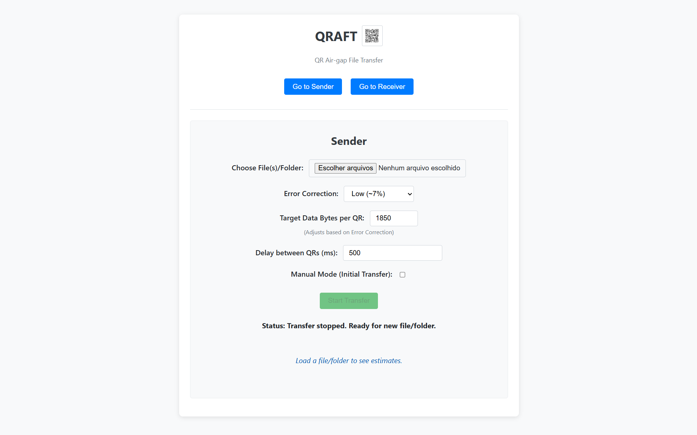

# QRAFT: QR Air-gap File Transfer

A web-based application demonstrating file transfer between two devices *solely* using a sequence of QR codes displayed on the sender's screen and scanned by the receiver's camera. No network connection (beyond loading the initial web page) is required between the devices during the transfer itself.

## Features

*   **File & Folder Transfer:** Send single files, multiple files, or entire folders.
*   **Offline Capable:** After loading the app, devices don't need to be on the same Wi-Fi or network for the transfer.
*   **Visual Transfer:** Data is encoded into a series of QR codes.
*   **Compression:** Files/folders are automatically zipped (using DEFLATE) before transfer to reduce the amount of data.
*   **Checksum Verification:** Ensures data integrity upon reception using a simple checksum.
*   **Configurable Settings:**
    *   QR Code Error Correction Level (L, M, Q, H)
    *   Target data size per QR code chunk
    *   Delay between QR codes (for automatic mode)
*   **Manual & Automatic Modes:**
    *   **Auto:** QR codes advance automatically based on the configured delay.
    *   **Manual:** Sender clicks a "Next QR" button to advance each code.
*   **Resend Capabilities:**
    *   Option to resend the entire sequence.
    *   Option to resend specific missing chunks (receiver indicates which ones).
    *   Resend operations can also be run in Manual or Auto mode.
*   **Responsive UI:** Transfer estimates (QR count, time) update dynamically as settings change.
*   **Modern Tech:** Built with Vite, TypeScript, and modern web APIs.

## How It Works

1.  **Sender:**
    *   Selects file(s) or a folder.
    *   The application uses JSZip to create a compressed `.zip` archive in memory.
    *   The zip file's binary data is encoded into a Base64 string.
    *   The Base64 string is split into smaller chunks based on the selected QR Error Correction level and target chunk size.
    *   A unique File ID and checksum for the zip data are generated.
    *   The sender displays a sequence of QR codes:
        *   **Handshake QR:** Contains metadata (File ID, total chunks, zip size, original filename if single).
        *   **Data QRs:** Each contains a chunk sequence number and the Base64 data chunk.
        *   **Final QR:** Contains the File ID and the checksum of the complete zip file.
    *   QR codes are displayed either automatically with a delay or manually via button clicks.
2.  **Receiver:**
    *   Starts the camera via the browser to scan QR codes.
    *   Scans the **Handshake QR** first to get metadata and the expected File ID/chunk count.
    *   Scans subsequent **Data QRs**, storing the chunks in memory using a Map keyed by sequence number. Duplicate scans are ignored.
    *   If the **Final QR** is scanned *before* all data chunks are received, it notes the missing chunks and continues scanning.
    *   Once the **Final QR** is scanned *and* all expected data chunks are present:
        *   The Base64 chunks are reassembled.
        *   The resulting data is decoded back into a binary ArrayBuffer.
        *   The size and calculated checksum of the received data are compared against the expected values from the Handshake/Final QRs.
        *   If verification passes:
            *   If it was a single file originally, the app attempts to extract it from the zip.
            *   The resulting file (extracted or the full zip) is offered to the user for download.
        *   If verification fails, an error is shown.

## Use Cases

*   Transferring files between devices when no common network (Wi-Fi, Bluetooth) is available or reliable (true "air-gap" transfer).
*   Situations where setting up other transfer methods (USB, cloud storage) is inconvenient or disallowed.
*   Quickly sharing very small sized files locally without configuration.
*   Demonstrating data encoding/transfer concepts visually.
*   A fun, albeit very slow, tech novelty!

## Technology Stack

*   **Build Tool:** [Vite](https://vitejs.dev/)
*   **Language:** TypeScript
*   **QR Code Generation:** [`qr-code-styling`](https://github.com/kozakdenys/qr-code-styling)
*   **QR Code Scanning:** [`qr-scanner`](https://github.com/nimiq/qr-scanner)
*   **File Compression:** [JSZip](https://github.com/Stuk/jszip)
*   **Core Web APIs:** File API, Camera API (via qr-scanner), Base64 encoding/decoding.

## Getting Started (Demo)

You can try a live demo of QRAFT here:

**[QRAFT](qr-air-gap-file-transfer.web.app)**

(If you want to run it locally, follow the standard procedure: clone the repo, `npm install`, `npm run dev:host`)

## Usage Guide

1.  **Open the App:** Open the demo link (or your local version) on both the sending and receiving devices.
2.  **Sender Device:**
    *   Navigate to the "Sender" view.
    *   Click "Choose File(s)/Folder" to select content.
    *   Adjust Error Correction, Chunk Size, Delay, and Initial Manual Mode if desired. Estimates will update.
    *   Click "Start Transfer". A modal with the first QR code will appear.
    *   If in Manual Mode, click "Next QR" to advance through the codes.
3.  **Receiver Device:**
    *   Navigate to the "Receiver" view.
    *   Click "Start Scanning". Grant camera permission if requested.
    *   Point the camera steadily at the QR codes displayed on the sender's screen. Ensure good lighting and focus.
    *   Status updates will show progress (Handshake OK, Received chunk X/Y, Waiting final...).
    *   If chunks are missed, the UI will indicate which ones are needed after the Final QR is seen. The sender can then use the "Send Specific" option in the modal.
    *   Once complete and verified, a file download will be triggered automatically.

## Configuration Options (Sender UI)

*   **Error Correction:** Higher levels allow the QR code to be partially obscured/damaged but reduce data capacity per QR. (M or L recommended for speed, Q or H for robustness).
*   **Target Data Bytes per QR:** Influences how large each Base64 chunk is. The app may use a smaller size if the target exceeds the capacity allowed by the selected Error Correction level. Larger values mean fewer QRs but each takes longer to scan.
*   **Delay:** Time (in ms) between showing QR codes in automatic mode. Adjust based on receiver's scanning speed.
*   **Manual Mode (Initial Transfer):** Check this to require clicking "Next QR" for the first full transfer sequence. Useful for difficult scanning conditions.
*   **(In Modal) Manual Resend:** Check this *before* clicking "Send All Again" or "Send Specific" to make *that specific resend operation* manual.

## Limitations & Known Issues

*   **Speed:** This method is inherently **very slow** due to QR code capacity limits and visual scanning time. Best suited for smaller files (up to a few **KB**). Transferring megabytes will take a significant amount of time and many QR codes.
*   **Large Files:** Very large files will result in an impractical number of QR codes, increasing the chance of errors and user fatigue.
*   **Screen/Camera Quality:** Reliability depends heavily on screen brightness/clarity, camera focus/resolution, and ambient lighting. Glare, reflections, and motion blur can prevent scans.
*   **CPU Usage:** Zipping/unzipping and Base64 operations can be CPU-intensive in the browser, especially on lower-powered devices. QR generation/scanning also adds load.
*   **Single Point of Failure:** Closing the browser tab or navigating away will interrupt the transfer, requiring a restart.

## Contributing

Contributions, issues, and feature requests are welcome! Please feel free to open an issue or submit a pull request on the project repository.

**(Optional: Add link to your repository here if applicable)**

## License

Distributed under the MIT License. See `LICENSE` file for more information.
(Or state: Copyright [Year] [Your Name]. Licensed under the MIT License.)
